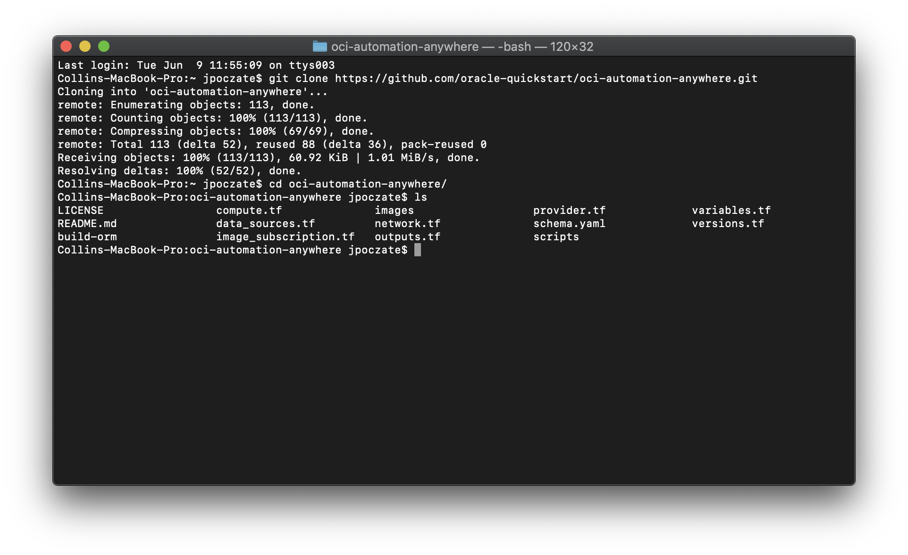
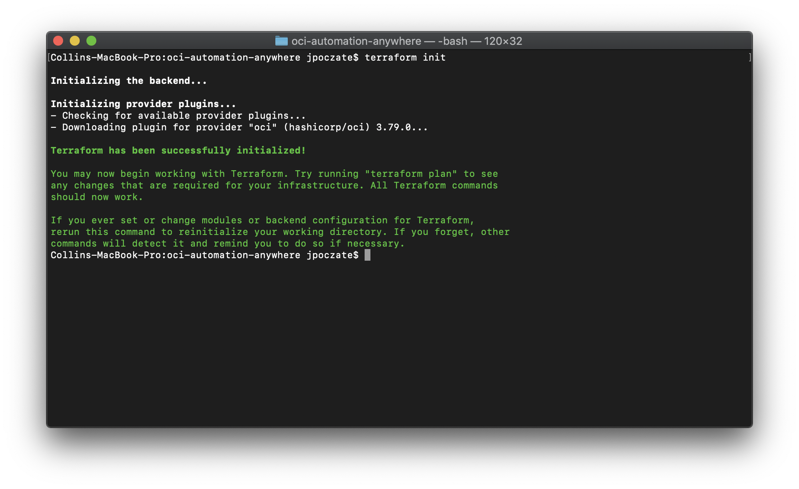
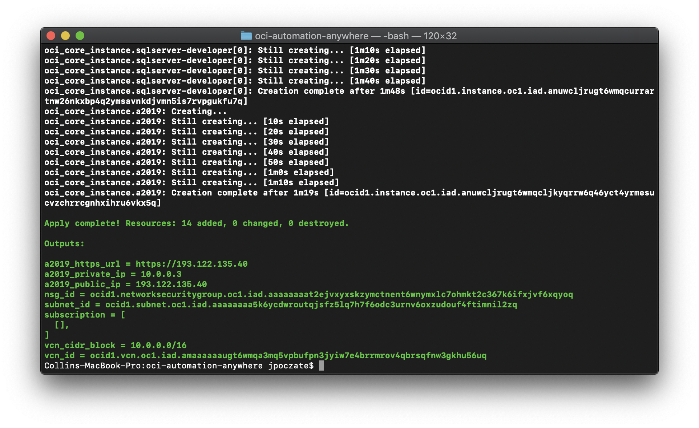
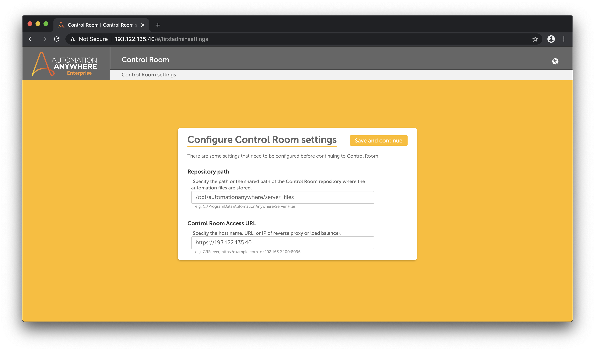
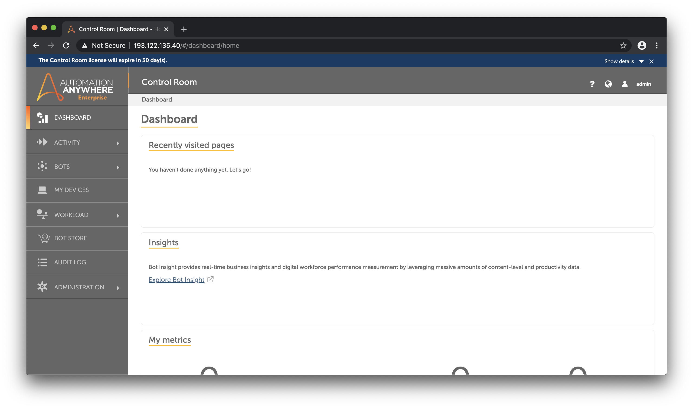
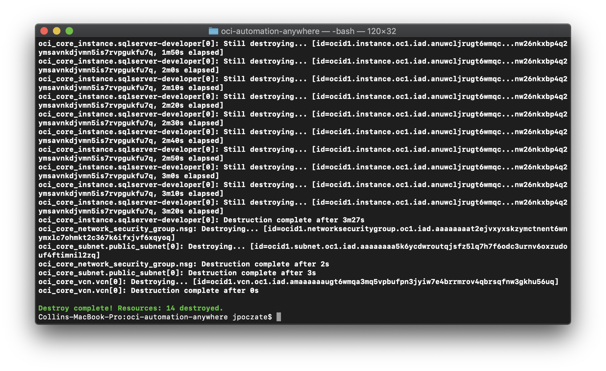

# oci-automation-anywhere
This is a Terraform module that deploys [Automation Anywhere](https://www.automationanywhere.com) on [Oracle Cloud Infrastructure (OCI)](https://cloud.oracle.com/en_US/cloud-infrastructure).  It is developed jointly by Oracle and Automation Anywhere.  While the Quick Start is great for extremely technical users, the Marketplace can also be useful as it provides a GUI deployment of Automation Anywhere.  That listing is contains the same Terraform as the Quick Start and is available [here](https://cloudmarketplace.oracle.com/marketplace/en_US/listing/73714334).

## Prerequisites
First off you'll need to do some pre deploy setup.  That's all detailed [here](https://github.com/oracle/oci-quickstart-prerequisites).

## Clone the Module
You'll first want a local copy of this repo by running:

```
git clone https://github.com/oracle-quickstart/oci-automation-anywhere.git
cd oci-automation-anywhere/
ls
```
That should give you this:



We now need to initialize the directory with the module in it.  This makes the module aware of the OCI provider.  You can do this by running:

```
terraform init
```
This gives the following output:



## Deploy

First we want to run `terraform plan`. This runs through the terraform and lists
out the resources to be created based on the values in `variables.tf`. If the
variable doesn't have a default you'll be promted for a value.

The only value without a value is `var.sql_pw` which is used for the default `SA`
user on the instance of SQL Server Developer created by default. This password
must meet the following or the post-deploy configuration will fail:
- 8 characters min
- Contains 3 of lower case, uppercase, number, symbol

If that's good, we can go ahead and apply the deploy:

```
terraform apply
```

You'll need to enter `yes` when prompted.  The apply should take several minutes
to run, and the final setup will happen asynchronously after this returns.

Once complete, you'll see something like this:



After a few minutes you'll be able to navigate to the `a2019_https_url` output of
the terraform. Once you accept the self-signed certificate, you'll be presented
with a configuration screen like this:



Enter these values:

- Repository path: _/opt/automationanywhere/server_files_
- Control Room Access URL: the same _https://..._ URL you navigated using `a2019_https_url`

Continue following the setup prompts. Note, setting the _Credential Vault_ to
_Express mode_ and using DB authentication are the simplest options and don't
require other pre-existing resources. Once complete you should see:



## Note on SQL Options

This terraform allows for 3 SQL DB option strings in `var.db_type`:
- `"SQL Server Developer"` (default)
- `"Existing SQL Server"`
- `"New Paid SQL Server"`

The last option will deploy **a paid instance of SQL Server which incurs a license
charge**. You also need to be whitelisted to allow this option, dicussed [here](https://cloudmarketplace.oracle.com/marketplace/en_US/listing/60923152).

## Destroy the Deployment
When you no longer need the deployment, you can run this command to destroy it:

```
terraform destroy
```

You'll need to enter `yes` when prompted.  Once complete, you'll see something like this:



All resources created by this deployment have now been destroyed.
